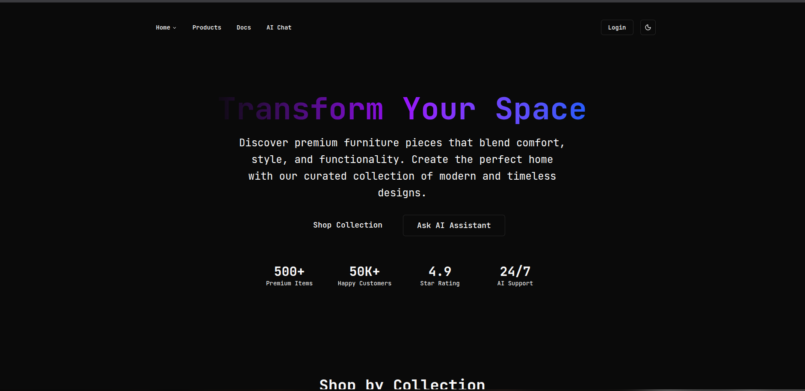

# 🛋️ Modern Furniture E-commerce Store

A full-stack modern furniture e-commerce application featuring AI-powered chat assistance, responsive design, and MongoDB integration. Built with React 19, TypeScript, Tailwind CSS, and LangChain.


## 📷 Snippets



## 🚀 Features

### Frontend (Client)

- **Modern React 19** with TypeScript and Vite
- **Responsive Design** with Tailwind CSS v4
- **Dark/Light Theme** toggle with persistent storage
- **React Router** for client-side navigation
- **shadcn/ui Components** for modern UI design
- **AI Chat Integration** with real-time messaging
- **Product Catalog** with filtering and pagination
- **Landing Page** with hero sections and testimonials

### Backend (Server)

- **Express.js** server with TypeScript
- **MongoDB Atlas** integration with vector search
- **LangChain** AI agent with Google Gemini
- **RESTful API** for products and chat
- **CORS** enabled for cross-origin requests
- **Error Handling** with fallback responses

## 📋 Prerequisites

Before setting up this project, ensure you have the following installed:

- **Node.js** (v18 or higher) - [Download](https://nodejs.org/)
- **npm** or **pnpm** (npm comes with Node.js)
- **Git** - [Download](https://git-scm.com/)
- **MongoDB Atlas Account** - [Sign up](https://www.mongodb.com/atlas)
- **Google AI API Key** - [Get API Key](https://ai.google.dev/)

## 🛠️ Installation & Setup

### 1. Clone the Repository

```bash
git clone <your-repository-url>
cd ecommerce-app
```

### 2. Install Dependencies

#### For Client (Frontend):

```bash
cd client
npm install
# or
pnpm install
```

#### For Server (Backend):

```bash
cd ../server
npm install
# or
pnpm install
```

### 3. Environment Configuration

Create a `.env` file in the `server` directory:

```bash
cd server
touch .env
```

Add the following environment variables to `server/.env`:

```env
# MongoDB Atlas Connection String
MONGODB_ATLAS_URI=mongodb+srv://<username>:<password>@<cluster-url>/?retryWrites=true&w=majority&appName=<app-name>

# Google AI API Key
GOOGLE_API_KEY=your_google_ai_api_key_here
```

### 4. Database Setup

#### Option A: Seed with Sample Data

```bash
cd server
npm run seed
```

#### Option B: Use Your Own MongoDB Database

1. Create a MongoDB Atlas cluster
2. Create a database named `furniture_store`
3. Create collections: `products`, `users`, `orders`
4. Update the connection string in `.env`

### 5. Start the Application

#### Start the Backend Server:

```bash
cd server
npm run dev
```

Server will run on `http://localhost:3000`

#### Start the Frontend Development Server:

```bash
cd client
npm run dev
```

Client will run on `http://localhost:5173`

## 🎯 Usage

### Accessing the Application

1. Open your browser and navigate to `http://localhost:5173`
2. The backend API should be running on `http://localhost:3000`

### Available Pages

- **Home** (`/`) - Landing page with furniture collections
- **Products** (`/products`) - Browse furniture catalog with filters
- **Chat** (`/chat`) - AI-powered furniture assistant
- **Components** (`/components`) - UI component showcase
- **Docs** (`/docs`) - Documentation and guides
- **Login** (`/login`) - User authentication (UI ready)

### Key Features to Test

1. **Theme Toggle**: Click the sun/moon icon to switch between light/dark themes
2. **Product Filtering**: Use price and category filters on the products page
3. **AI Chat**: Ask questions about furniture on the chat page
4. **Responsive Design**: Test on different screen sizes

## 🏗️ Project Structure

```
ecommerce-app/
├── client/                     # Frontend React application
│   ├── src/
│   │   ├── components/         # Reusable UI components
│   │   │   ├── ai/            # AI chat components
│   │   │   ├── layout/        # Navigation and layout
│   │   │   ├── themes/        # Theme provider and toggle
│   │   │   └── ui/            # shadcn/ui components
│   │   ├── pages/             # Page components
│   │   │   ├── HomePage.tsx   # Landing page
│   │   │   ├── ProductsPage.tsx # Product catalog
│   │   │   ├── chat.tsx       # AI chat interface
│   │   │   └── ...
│   │   ├── lib/               # Utility functions
│   │   ├── App.tsx            # Main app component
│   │   └── main.tsx           # Entry point
│   ├── package.json
│   └── vite.config.ts
│
├── server/                     # Backend Express application
│   ├── agent.ts               # LangChain AI agent
│   ├── index.ts               # Express server setup
│   ├── mock-data.ts           # Sample product data
│   ├── seed-database.ts       # Database seeding script
│   ├── package.json
│   └── .env                   # Environment variables
│
└── README.md                  # This file
```

## 🔧 Configuration Options

### Client Configuration

#### Vite Configuration (`client/vite.config.ts`)

- Path aliases for imports
- Tailwind CSS v4 integration
- React plugin configuration

#### Theme Configuration

- Default theme: Dark mode
- Storage key: `vite-ui-theme`
- Supports: light, dark, system themes

### Server Configuration

#### MongoDB Settings

- Database: `furniture_store`
- Collections: `products`, `users`, `orders`
- Vector search enabled for AI features

#### API Endpoints

- `GET /api/products` - Fetch all products
- `POST /api/chat` - Send message to AI agent
- `GET /api/health` - Server health check

## 🎨 Customization

### Adding New Components

```bash
# Using shadcn/ui CLI (if installed)
npx shadcn-ui@latest add <component-name>

# Or manually create in src/components/ui/
```

### Modifying Themes

Edit `client/src/index.css` to customize CSS variables:

```css
:root {
  --primary: your-color-values;
  --secondary: your-color-values;
}
```

### Adding New API Endpoints

Add routes in `server/index.ts`:

```typescript
app.get("/api/your-endpoint", (req, res) => {
  // Your logic here
});
```

## 🔍 Troubleshooting

### Common Issues

#### 1. Theme Toggle Not Working

- Ensure CSS variables are properly defined in `index.css`
- Check that ThemeProvider wraps the entire app
- Verify Tailwind CSS v4 is properly configured

#### 2. MongoDB Connection Issues

- Check your connection string format
- Ensure IP address is whitelisted in MongoDB Atlas
- Verify credentials are correct

#### 3. AI Chat Not Responding

- Check Google AI API key is valid
- Monitor API quota usage
- Review server logs for errors

#### 4. Build Errors

```bash
# Clear cache and reinstall
rm -rf node_modules package-lock.json
npm install

# For client
cd client && rm -rf node_modules && npm install

# For server
cd server && rm -rf node_modules && npm install
```

#### 5. Port Already in Use

```bash
# Kill process on port 3000 (server)
lsof -ti:3000 | xargs kill -9

# Kill process on port 5173 (client)
lsof -ti:5173 | xargs kill -9
```

## 📦 Dependencies

### Client Dependencies

- **React 19.1.1** - UI library
- **React Router DOM 7.8.2** - Client-side routing
- **Tailwind CSS 4.1.12** - Utility-first CSS framework
- **@radix-ui** - Headless UI components
- **Lucide React** - Icon library
- **@ai-sdk/react** - AI SDK for React integration

### Server Dependencies

- **Express 4.19.2** - Web framework
- **MongoDB 6.8.0** - Database driver
- **LangChain** - AI framework
- **@langchain/google-genai** - Google AI integration
- **CORS 2.8.5** - Cross-origin resource sharing

## 🚀 Deployment

### Frontend (Vercel/Netlify)

```bash
cd client
npm run build
# Deploy the dist/ folder
```

### Backend (Railway/Heroku)

```bash
cd server
# Set environment variables in your hosting platform
# Deploy with your preferred method
```

### Environment Variables for Production

```env
NODE_ENV=production
MONGODB_ATLAS_URI=your_production_mongodb_uri
GOOGLE_API_KEY=your_production_google_api_key
PORT=3000
```

## 🤝 Contributing

1. Fork the repository
2. Create a feature branch (`git checkout -b feature/amazing-feature`)
3. Commit your changes (`git commit -m 'Add amazing feature'`)
4. Push to the branch (`git push origin feature/amazing-feature`)
5. Open a Pull Request

## 📄 License

This project is licensed under the MIT License - see the [LICENSE](LICENSE) file for details.

## 🙏 Acknowledgments

- [shadcn/ui](https://ui.shadcn.com/) - For the beautiful UI components
- [Tailwind CSS](https://tailwindcss.com/) - For the utility-first CSS framework
- [LangChain](https://langchain.com/) - For the AI integration framework
- [Radix UI](https://www.radix-ui.com/) - For the headless UI primitives
- [Lucide Icons](https://lucide.dev/) - For the icon library
- [MongoDB](https://www.mongodb.com/) - For the database platform
- [Google AI](https://ai.google.dev/) - For the AI API

## 📞 Support

If you encounter any issues or have questions:

1. Check the [Troubleshooting](#🔍-troubleshooting) section
2. Search existing issues on GitHub
3. Create a new issue with detailed information
4. Contact the development team

---

**Happy coding! 🎉**

Built with ❤️ using modern web technologies.

# Ecommerce-With-AI-Assistant
